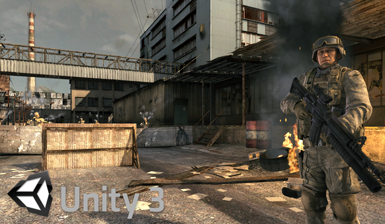

# Unity Bootcamp Demo

This project is targeted to upgrade the old Unity example demo "Bootcamp" to the newest version possible, keeping the original functionality also using the latest Unity's engine features.

At this point, the project is running at Unity 4.5.0f6 absolutely fine. Opening it with the latest version directly is currently impossible, because of:

- The asset links may be broken, so they have to be restored by hand.
- This project is using old Unity Script code, which is removed from Unity since [version 2017.2](https://blogs.unity3d.com/2017/08/11/unityscripts-long-ride-off-into-the-sunset/). Those scripts have to be updated/rewritten by hand (which may take a lot of time, though there's a [tool for auto upgrading](https://blogs.unity3d.com/2019/01/08/unityscript-to-c-conversion-tool/)).

This is a iterative process, because, idealy, it has to be opened with each major Unity version to be updated, considering backward compatibility.
